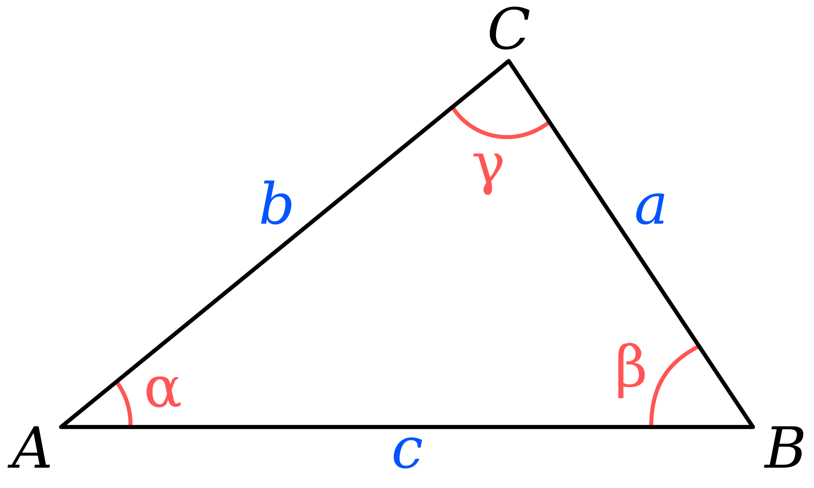

# Law of cosines

The law of cosines relates the lengths of the sides of a triangle to the cosine of one of its angles.

$$
a^2 = b^2 + c^2 - 2bc\cos{(\alpha)}
$$

## Additional Formulae

  For finding the side opposite of an angle

$$
c = \sqrt{a^2 + b^2 - 2ab\cos{\gamma}} 
$$

  For finding the angle opposite a side
$$
\gamma = \cos^{-1}{\frac{a^2+b^2-c^2}{2ab}}
$$
